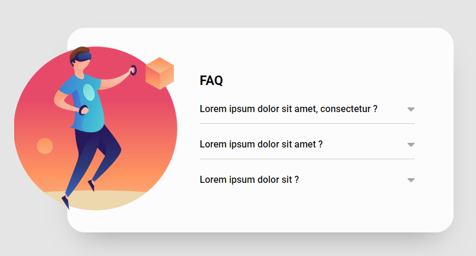
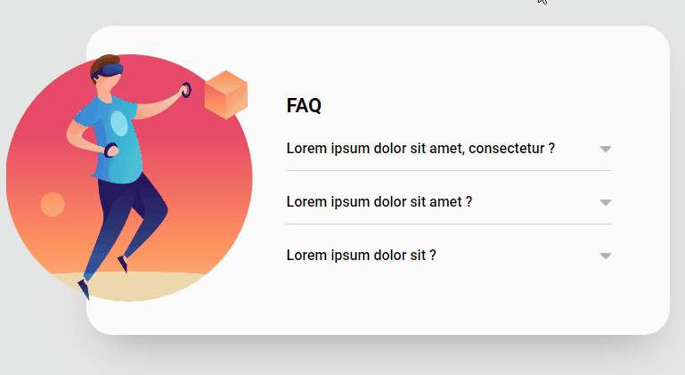

Este projeto, é o exercício 6 do módulo de Javascript intermediário, do curso DevQuest.


## Acordeon
Estamos simulando uma seção de perguntas e respostas de um site qualquer. Ao clicar na pergunta, abrirá a caixinha de resposta.


## Técnologias utilizadas
- HTML
- CSS
- Javascript

## Demonstração do projeto
Este projeto é chamado de Acordeon, em razão das respostas abrirem e fecharem. Só é permitido abrir uma resposta de cada vez, portanto, elas ficam se alternando.


### Conclusão
O truque, acontece nas `CSS`, configurando a classe `".resposta"` para quando a classe `".ativo"` for incluída, junto da classe `".perguntas"`
```
.acordeon .perguntas.ativo .resposta{
    display: block;
}
```

E obviamente, tudo acontece, quando adicionamos a classe _".ativo"_ com o `Javascript`